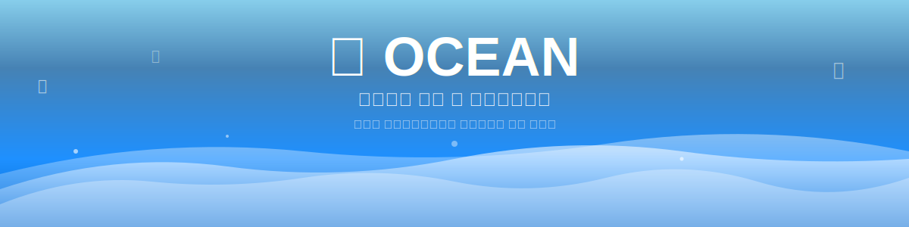
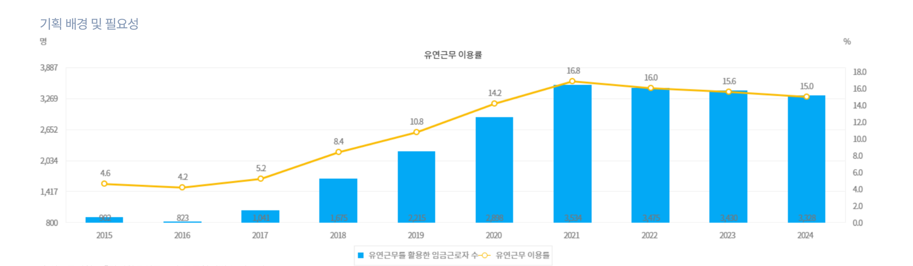
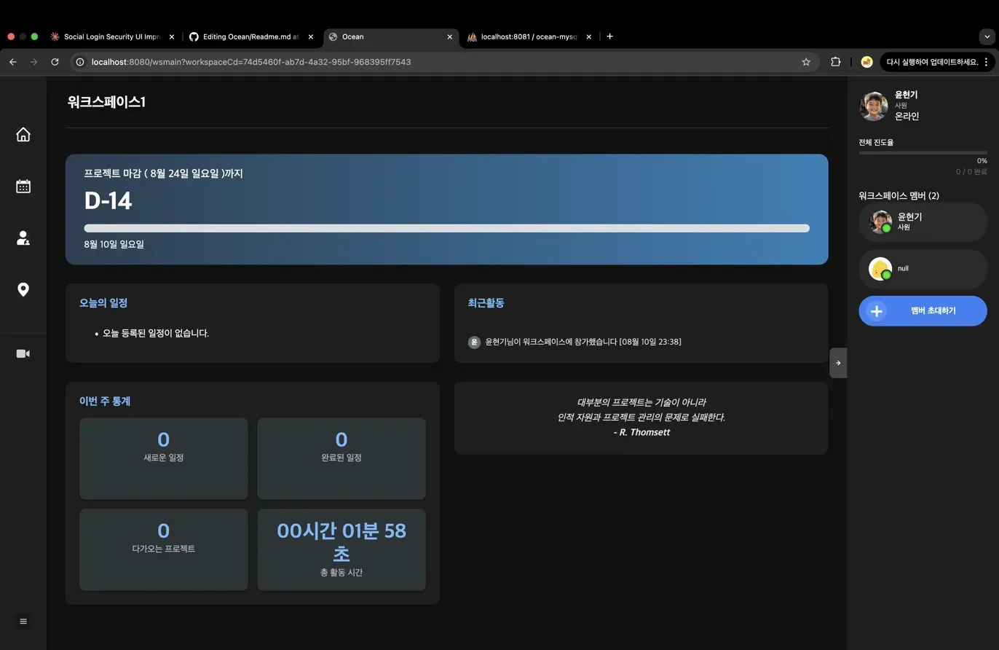

<div align="center">
  
</div>

## 함께해준 팀원들
<div align="center">
<table>
<tr>
  <td align="center">
    <br/>
    <sub><b>👨‍💻 윤현기</b></sub><br/>
    <sub>Team Leader & FE&BE</sub><br/>
    <sub>🔧 DevOps • 📽️ CamChats • 🔐 Login</sub>
  </td>
  <td align="center">
    <br/>
    <sub><b>👨‍💻 권지언</b></sub><br/>
    <sub>Backend Developer</sub><br/>
    <sub>🗄️ Database • ⚙️ Backend Logic</sub>
  </td>
  <td align="center">
    <br/>
    <sub><b>👩‍💻 이수민</b></sub><br/>
    <sub>Backend Developer</sub><br/>
    <sub>📅 Calendar • 🪣 AWS S3</sub>
  </td>
  <td align="center">
    <br/>
    <sub><b>👨‍💻 김보성</b></sub><br/>
    <sub>Frontend Developer</sub><br/>
    <sub>🎨 UI/UX • 📍 Map</sub>
  </td>
  <td align="center">
    <br/>
    <sub><b>👨‍💻 임형택</b></sub><br/>
    <sub>Frontend Developer</sub><br/>
    <sub>🎨 UI/UX</sub>
  </td>
</tr>
</table>

  
## 🛠️ 기술 스택

### **Frontend**

<div align="center">
  <table>
    <tr>
      <td align="center" width="120">
        
        <br><sub><b>HTML5</b></sub>
      </td>
      <td align="center" width="120">
        
        <br><sub><b>CSS3</b></sub>
      </td>
      <td align="center" width="120">
        
        <br><sub><b>JavaScript ES6+</b></sub>
      </td>
      <td align="center" width="120">
        
        <br><sub><b>Thymeleaf</b></sub>
      </td>
    </tr>
  </table>
</div>

### **Backend**

<div align="center">
  <table>
    <tr>
      <td align="center" width="120">
        
        <br><sub><b>Java 17</b></sub>
      </td>
      <td align="center" width="120">
        
        <br><sub><b>Spring Boot 3.5</b></sub>
      </td>
      <td align="center" width="120">
        
        <br><sub><b>Node.js</b></sub>
      </td>
      <td align="center" width="120">
        
        <br><sub><b>MyBatis</b></sub>
      </td>
      <td align="center" width="120">
        
        <br><sub><b>JPA/Hibernate</b></sub>
      </td>
    </tr>
  </table>
</div>

### **Database**

<div align="center">
  <table>
    <tr>
      <td align="center" width="120">
        
        <br><sub><b>MySQL 8.0</b></sub>
      </td>
      <td align="center" width="120">
        
        <br><sub><b>phpMyAdmin</b></sub>
      </td>
      <td align="center" width="120">
        
        <br><sub><b>Spring Session</b></sub>
      </td>
    </tr>
  </table>
</div>

### **보안 및 인증/인가**

<div align="center">
  <table>
    <tr>
      <td align="center" width="120">
        
        <br><sub><b>OAuth2</b></sub>
      </td>
      <td align="center" width="120">
        
        <br><sub><b>JWT</b></sub>
      </td>
      <td align="center" width="120">
        
        <br><sub><b>Google Login</b></sub>
      </td>
      <td align="center" width="120">
        
        <br><sub><b>Kakao Login</b></sub>
      </td>
    </tr>
  </table>
</div>

###  **Cam Chats**

<div align="center">
  <table>
    <tr>
      <td align="center" width="120">
        
        <br><sub><b>WebRTC</b></sub>
        <br><sub><i>P2P 화상통신</i></sub>
      </td>
      <td align="center" width="120">
        
        <br><sub><b>Socket.io</b></sub>
        <br><sub><i>실시간 통신</i></sub>
      </td>
      <td align="center" width="120">
        
        <br><sub><b>MediaSoup</b></sub>
        <br><sub><i>SFU 미디어 서버</i></sub>
      </td>
    </tr>
  </table>
</div>

**실시간 통신 구현 상세:**

| **기술** | **역할** | **성과** |
|:---:|:---|:---|
| **WebRTC** | P2P 연결 및 미디어 스트림 | 지연시간 50ms 이하 |
| **MediaSoup** | SFU 방식 다자간 연결 | 최대 10명 동시 참여 |
| **Socket.io** | 시그널링 및 채팅 | 실시간 메시지 전송 |
| **적응형 비트레이트** | 네트워크 상황 대응 | 연결 안정성 90% |

### **DevOps & distribution**

<div align="center">
  <table>
    <tr>
      <td align="center" width="150">
        
        <br><sub><b>Docker</b></sub>
      </td>
      <td align="center" width="150">
        
        <br><sub><b>AWS EC2</b></sub>
      </td>
      <td align="center" width="150">
        
        <br><sub><b>Nginx</b></sub>
      </td>
      <td align="center" width="150">
        
        <br><sub><b>Jenkins</b></sub>
      </td>
    </tr>
    <tr>
      <td align="center" width="150">
        
        <br><sub><b>GitHub Actions</b></sub>
      </td>
      <td align="center" width="150">
        
        <br><sub><b>AWS S3</b></sub>
      </td>
      <td align="center" width="150">
        
        <br><sub><b>Route53</b></sub>
      </td>
      <td align="center" width="150">
        
        <br><sub><b>Let's Encrypt</b></sub>
      </td>
    </tr>
  </table>
</div>

### **Tools**

<div align="center">
  <table>
    <tr>
      <td align="center" width="120">
        
        <br><sub><b>IntelliJ IDEA</b></sub>
      </td>
      <td align="center" width="120">
        
        <br><sub><b>Git</b></sub>
      </td>
      <td align="center" width="120">
        
        <br><sub><b>GitHub</b></sub>
      </td>
      <td align="center" width="120">
        
        <br><sub><b>Figma</b></sub>
      </td>
    </tr>
  </table>
</div>

### **Highlights**

<table align="center">
<tr>
<td align="center" width="25%">
  
  <br/><b>🎨 Frontend</b>
  <br/><sub>Thymeleaf + JS<br/>반응형 웹 인터페이스</sub>
</td>
<td align="center" width="25%">
  
  <br/><b>⚙️ Backend</b>
  <br/><sub>Spring Boot + JPA/MyBatis<br/>하이브리드 아키텍처</sub>
</td>
<td align="center" width="25%">
  
  <br/><b>🎥 Real-time</b>
  <br/><sub>WebRTC + MediaSoup<br/>다자간 화상채팅</sub>
</td>
<td align="center" width="25%">
  
  <br/><b>🚀 DevOps</b>
  <br/><sub>Docker + AWS + CI/CD<br/>배포 자동화</sub>
</td>
</tr>
</table>

## 기획의도
<div align="center">
  
  <br/><br/>
  <sub><em>📊 출처: 통계청, 「경제활동인구조사 근로형태별 부가조사」</em></sub>
</div>
  
원격 근무와 유연 근무 확산으로 조직 내 소통과 협업의 어려움 증가 했고

다양한 협업 툴을 따로 사용하면서 정보가 분산되고 관리가 복잡해지는 불편함 발생 하였습니다.

## 💌 서비스 화면 및 기능 소개

### ⭐️ Mainpage
<div align="center">
  
  <br/>💡 <strong>웹 애플리케이션을 소개 해주는 접속 시 나오는 첫 페이지 입니다.</strong>
  <br/><sub>1. 전체 배경은 컨셉에 맞게 바다의 느낌을 동적인 애니메이션으로 추가 하였고 그 이후 스와이프 형태로 저희의 기능을 소개 합니다.</strong></sub>
  <br/><sub>2. 또한 첫 페이지를 재방문한 사용자에게 루즈한 경험을 줄 수 있으므로 글자를 클릭 하면 스킵을 가능 하도록 만들어 놨습니다.</strong></sub>
</div>

## ⭐️ Login
<div align="center">
  
  <br/>💡 <strong>로그인 페이지 입니다.저희 서비스에선 현재 소셜 로그인을 제공 합니다.</sub>
    <br/>

### 🤔 **`WHY?`**
소셜 로그인은 빠르게 회원가입을 할 수 있으므로 `'사용자 이탈율'`을 줄이기 위해 채택 했습니다.

  <br/><sub>2. 사용자의 급증을 대비하여 JWT기능을 구현 했습니다</strong></sub>
  <br/><sub>3. 또한, XSS 공격 방지를 위해 HttpOnly 쿠키 방식을 채택 했고, CSRF 보호를 위해 SamSite 속성을 적용 했습니다.</strong></sub>
  <br/><sub>4. 사용자의 경험을 향상 시키기 위해 토큰 만료 5분전 자동 갱신 로직을 구현 하였습니다.</strong></sub>
<br/>
</div>

## ⭐️ Workspace List
<div align="center">
  
  <br/>💡 <strong>로그인 성공 후, 워크스페이스 리스트 페이지에 리다이렉트 되고 워크스페이스 생성,참가를 할 수 있습니다.</strong>
  <br/><sub>1. 사용자 경험을 위해 생성 절차를 스와이프 형태로 단계적 폼으로 구현 했습니다.</strong></sub>
  <br/><sub>2. 파일 업로드 시 UUID로 파일명 중복을 방지하고, 트랜잭션을 통해 파일 저장과 DB 작업의 원자성을 보장했습니다.</strong></sub>
  
</div>

<br/>
<br/>

<div align="center">
  
  <br/>💡 <strong>워크스페이스 생성 후, 해당 사용자의 추가 정보 입력 폼으로 넘어 갑니다.</strong>
  <br/>

### 🤔 **`WHY?`**
`'온보딩 완료율'`을 위해 추가 정보는 나중에 입력 받을 수 있도록 했습니다

  <br/><sub>1. 정보입력 절차를 스와이프 형태로 단계적 폼으로 구현 하였고, 모든 워크스페이스 접근 시점에 인터셉터를 통해 프로필을 검증 합니다.</strong></sub>
  <br/><sub>2. 한 사용자가 여러 워크스페이스에서 다른 역할과 정보를 가질 수 있는 멀티테넌트 구조로 설계 했습니다.</strong></sub>
<br/>
<br/>
  
</div>

<div align="center">
  
  <br/>💡 <strong>워크스페이스 참가 시 워크스페이스가 생성 될 떄 나오는 초대 코드로 호스트에게 전송 할 수 있습니다.</strong>
  <br/><sub>1. 초대 코드는 외부 노출되므로 보안에 위협이 될 수 있으므로 UUID의 처음 8자리만 사용 했습니다.</strong></sub>
</div>


## ⭐️ Main Workspace
<div align="center">
  
  <br/>💡 <strong>워크스페이스 생성 후, 나오는 워크스페이스 메인페이지 입니다</strong>
  <br/><sub>1. 해당 워크스페이스에 온보딩을 완료하지 않은 사용자는 추가정보 폼으로 리다이렉트 됩니다.</strong></sub>
  <br/><sub>2. 워크스페이스 메인 페이지 Body에는 해당 워크스페이스의 전체적인 정보를 볼 수 있는 대시보드로 형성 했습니다.</strong></sub>
  <br/><sub>3. 온보딩을 완료 하지 않은 사용자는 워크스페이스 메인 페이지 에서 default.png 사진으로 처리 되고, 프로필이 미설정 되었다는 뱃지가 표시 됩니다.</strong></sub>
</div>

### 🚨 Issue: 온보딩 미완료 사용자 정보 NULL 표시 문제

#### **문제점**
- **상황**: 워크스페이스 초대 수락 후 프로필 설정을 하지 않은 사용자가 멤버 목록에 `null`로 표시
- **영향**: 서비스를 이용 하는 사용자에게 정확한 정보를 전달 해주지 못함 (UI/UX 저하발생) 
- **원인**: DB 스키마와 비즈니스 로직 간 데이터 연계 부족

<details>
<summary>🔍 문제 상황 보기 (클릭하여 펼치기)</summary>

### Before: NULL 표시 문제


> 워크스페이스 멤버 목록에서 프로필 미설정 사용자가 'null'로 표시되는 문제

**문제가 있던 코드:**
``` javascript
// Before: 문제가 있던 코드
memberDiv.innerHTML = `
    <span class="m-name">${member.userNickname}</span>  // null 표시
    <span class="m-role">${member.position}</span>      // null 표시
`;

// After: 개선된 코드
const displayName = member.userNickname || member.userName || '프로필 미설정';
const displayPosition = member.position || '직급 미설정';
const needsProfile = !member.userNickname;

memberDiv.innerHTML = `
    <div class="member-info">
        <span class="m-name ${needsProfile ? 'needs-profile' : ''}">${displayName}</span>
        ${needsProfile ? '<span class="profile-badge">!</span>' : ''}
        <span class="m-role">${displayPosition}</span>
    </div>
`;

```
✅✅✅ 워크스페이스 멤버 NULL 표시 이슈 해결 ✅✅✅
## 해결 방법: Backend JOIN 쿼리 개선 하였고  Frontend Null Safety 처리를 하여 문제를 해결 했습니다.
</details>

## ⭐️ Calendar, Meeting Page
<div align="center">
  
  <br/>💡 <strong>팀원들과 일정을 실시간으로 공유하고 관리하는 캘린더 페이지 입니다.</strong>
  <br/><sub>1. FullCalendar의 refetchEvents API를 활용하여 실시간 동기화를 구현 했습니다.</sub>
  <br/><sub>2. 페이지를 전체 새로 고침 하는 'location.reload()' 대신 ===> 캘린더만 업데이트 하는 'calendar.refetchEvents()' 변경 하여 UX 개선 및 네트워크 비용 절감 했습니다.</sub>
  <br/><sub>3. Kakao Map API와 FullCalendar 라이브러리를 연동하여 일정 추가 시 장소 추가 시 모임장소 페이지에도 추가 됩니다.</sub>
  <br/>
  
</div>

## ⭐️ Cam-Chats Pages
<div align="center">
  
  <br/>💡 <strong>최대 12명이 참가 할 수 있는 다자간 화상 채팅 페이지 입니다.</strong>
  <br/><sub>1. 내용</sub>
  <br/><sub>2. 내용</sub>
  <br/><sub>3. 내용</sub>
  <br/>
  
</div>

# Ocean
# Ocean
